# 「Vibe Zenning」のススメ

昨今の「Vibe Coding」や「Vibe Working」の流れに乗って、Zennの記事執筆も「Vibe」でやってしまおうという提案です。その名も**「Vibe Zenning」**！

この記事では、@akinobukatoさんの[こちらの記事](https://zenn.dev/acntechjp/articles/5a8b7b334b15bc)にインスパイアされ、私が機能を拡張（魔改造）した「Markdown Studio」を活用した執筆フローをご紹介します。

オリジナルのMarkdown Studioはこちら：
https://github.com/5843435/markdown-sheet

今回の「Vibe Zenning」スタイルでは、ローカルで爆速動作する音声認識モデル「**Moonshine**」による音声入力と、AIによる自動整形を組み合わせ、思考をダイレクトに記事へと変換します。

:::message
音声入力には、最近話題の高速・高精度な音声認識モデル **Moonshine** を使用しています。ローカル環境で動作するため、プライバシーを保ちつつ非常にスムーズな書き起こしが可能です。
:::

## 1. セットアップと設定

まずは[改造版のMarkdown Studio](https://github.com/straygizmo/markdown-sheet)をセットアップし、Zennモードを有効にします。

事前にZenn側で「GitHub連携」の設定を行い、連携済みリポジトリのURLを手元に用意しておいてください。

### モデルとAPIの設定
右上の設定ボタン（歯車アイコン）をクリックし、APIキーや使用する音声認識モデル（Moonshineなど）の設定を行います。

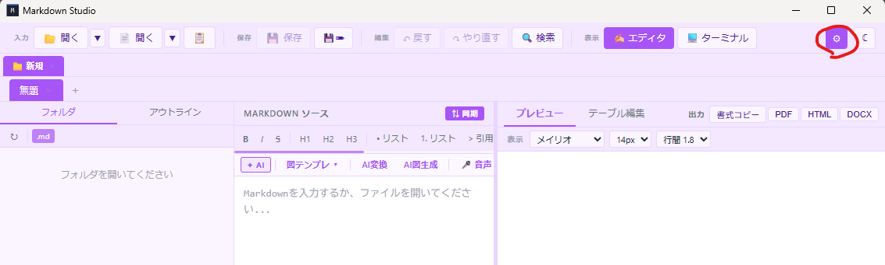

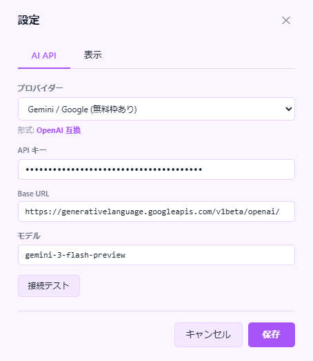

### Zennボタンの有効化
「表示」タブから「Zennボタンを表示」にチェックを入れます。これでサイドバーにZenn専用の機能が表示されます。

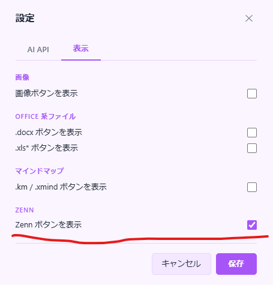

## 2. Zennプロジェクトの作成・連携

画面左上の「フォルダを開く」ボタンから、記事を管理したいディレクトリを選択します。


サイドバーに現れた「Zennボタン」をクリックします。

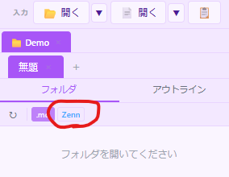

「Zennプロジェクトの初期化」ダイアログが表示されたら、GitHubのリポジトリURLを入力して実行します。

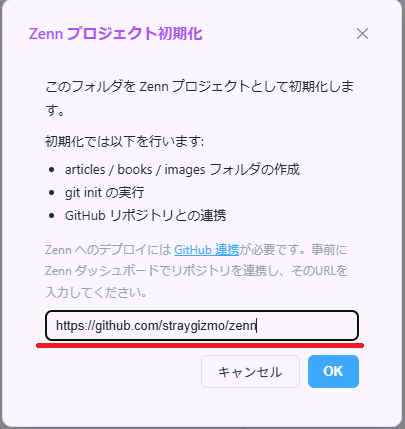

## 3. 記事の新規作成

プロジェクトの準備ができたら、画面右上の「記事の新規作成」ボタンを押します。

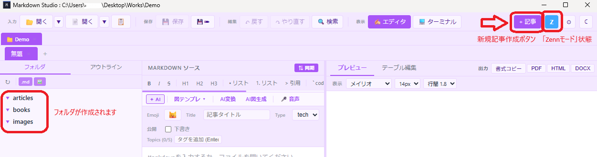

ファイル名と記事タイトルを入力すると、Zennのルールに従ったフロントマター（YAML）付きのMarkdownファイルが自動生成されます。


これで執筆の準備が整いました！

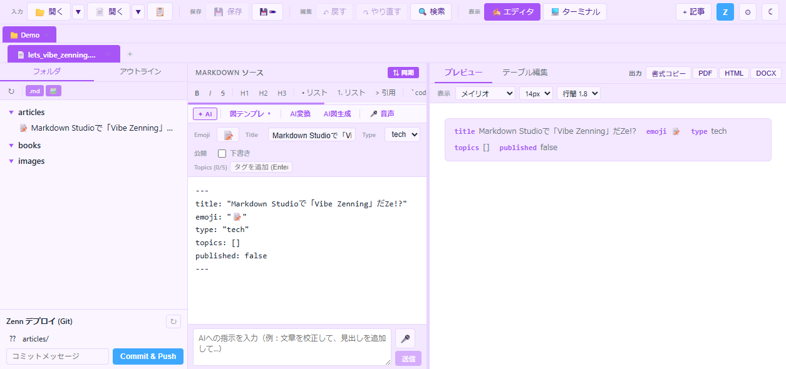

## 4. 音声入力と執筆（Vibeポイント）

### 音声認識の開始
:::message
**Vibeポイントその1：音声入力**
キーボードを叩く前に、まずは喋りましょう。
:::

エディター上で `Ctrl + Space` を押すと、音声認識が開始されます。

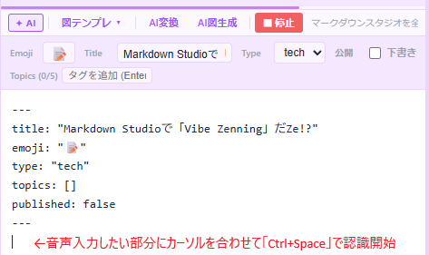

あとはマイクに向かって思考を垂れ流すだけです。Moonshineがリアルタイムに近い速度で、あなたの言葉をテキストに変えてくれます。

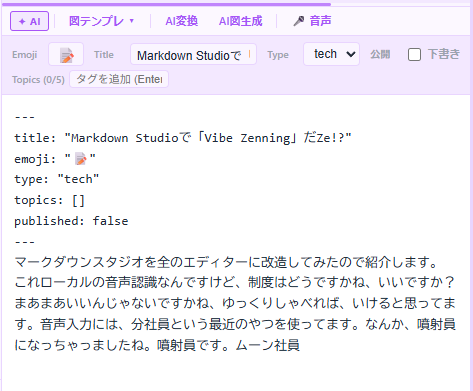

### 画像の直感的な挿入
画像を使いたい場合は、あらかじめ `images` フォルダに入れておいたファイルをエディタへドラッグ＆ドロップするだけ。適切なパスが即座に挿入されます。

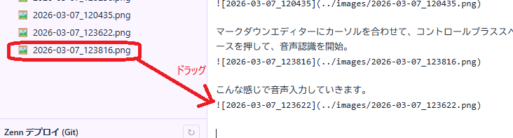

## 5. AIによる仕上げ

:::message
**Vibeポイントその2：AIによる自動校正**
「下書き」を「記事」に昇華させます。
:::

一通り喋り終えたら、AIチャットに向かって「記事の体裁を整えて」と指示を出します。


Markdown StudioにはZenn専用のシステムプロンプトが組み込まれており、雑なメモ書きをZenn独自の記法（メッセージボックスやリンクカード）を駆使した読みやすいTech記事へと変貌させてくれます。

:::details 組み込まれているシステムプロンプトの内容
```javascript:systemPrompt.js
const systemPrompt =
          "あなたはZenn (zenn.dev) 記事のMarkdown編集アシスタントです。ユーザーの指示に従って、与えられたMarkdown本文を編集・加筆・修正してください。\n" +
          "結果はMarkdown本文のみを返してください。説明やコードブロック囲みは不要です。\n\n" +
          "## Zenn記事のルール\n" +
          "- フロントマター(---で囲まれたYAML部分)は必須です。必ずそのまま残してください。指示がある場合のみ編集してください。\n" +
          "  フロントマターの形式:\n" +
          "  ---\n" +
          "  title: \"記事タイトル\"\n" +
          "  emoji: \"🚀\"\n" +
          "  type: \"tech\"  # tech or idea\n" +
          "  topics: [\"python\", \"automation\"]\n" +
          "  published: true  # false = 下書き\n" +
          "  ---\n\n" +
          "## Zenn独自の記法（積極的に活用してください）\n" +
          "- メッセージボックス: :::message ... ::: または :::message alert ... :::\n" +
          "- アコーディオン: :::details タイトル ... :::\n" +
          "- コードブロックにファイル名: ```python:main.py\n" +
          "- diffハイライト: ```diff python\n" +
          "- 数式(KaTeX): $ E = mc^2 $\n" +
          "- Mermaid図: ```mermaid ... ```\n" +
          "- リンクカード: URLを単独の行に置くだけで自動展開\n" +
          "- 画像サイズ指定:  — =〇〇x でpx幅指定\n";
```
:::

:::details 元の「Vibeな」内容
マークダウンスタジオを全のエディターに改造してみたので紹介します。
これローカルの音声認識なんですけど、制度はどうですかね、いいですか？
まあまあいいんじゃないですかね、ゆっくりしゃべれば、いけると思ってます。音声入力には、分社員という最近のやつを使ってます。
なんか、噴射員になっちゃっましたね。噴射員です。ムーン社員


手順
マークダウンスタジオ開いて右上の設定ボタンを押す。


ａｐｂｙｋｇｉｃｈとかモデルを設定する。


表示タブの前保たんを表示にチェックする。


画面左上のボルダーの開くボタンをクリックする。
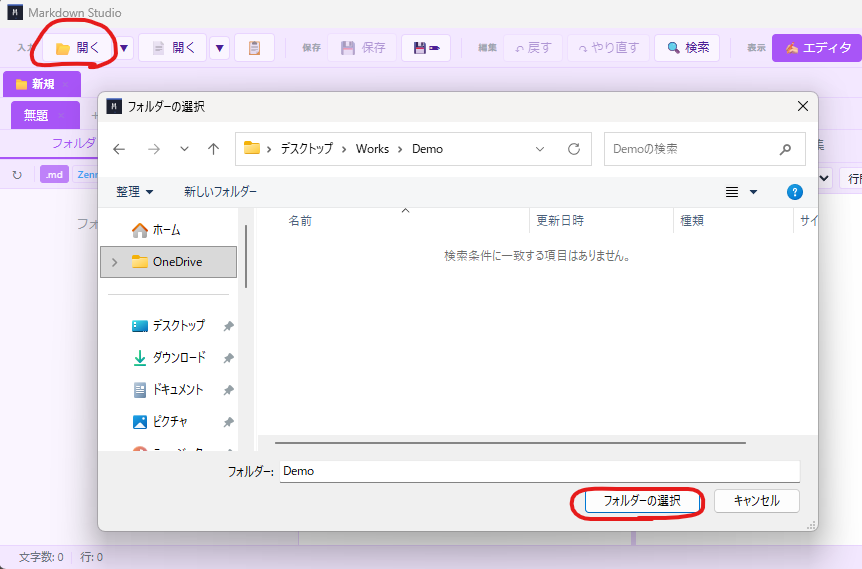

全ボタンをクリックする。


ゼントロジェクトの初期化ダイアログでＯＫＯＳ。
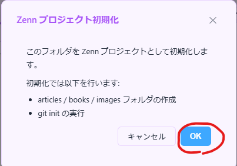

オルダが全モードになるので画面右上の生地の新規作成ボタンを押す。


ワイルメーとタイトルを決定して、作成ボタンを押す。
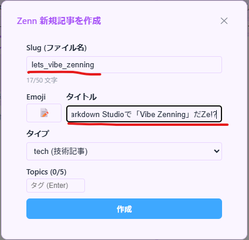
こんな感じの画面になります。


マークダウンエディターにカーソルを合わせて、コントロールプラススペースを押して、音声認識を開始。


こんな感じで音声入力していきます。


画像ファイルは、イメージズフォルダーに入れて、そこからマークダウンとリターンにドラッグします。


人通り内容を入れたら、ＡＩに記事の掲載を整えてもらうのもように頼みます。
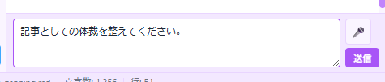
:::